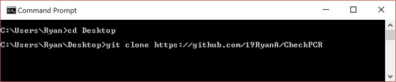

Check PCR
========

A client for the homework system currently used by the Harker School, PCR.

********************************************************************************************************************************************************************
#### 
Important Notice

**
If you want to see the whole month in calendar view, leave PCR in month view. Otherwise, if you only want to see one week, put it on list view.
**
********************************************************************************************************************************************************************

If you are feeling bored and have nothing else to do or are suspicious of what the program does with your password, **feel free to take a look at the [Literate Coffeescript code](client.litcoffee)**, which gets compiled into one of the two Javascript scripts used by the app (the other is headroom.js, downloaded from [here](http://wicky.nillia.ms/headroom.js/), which toggles the navbar visibility). If you are feeling extra suspicious, you can also compile `client.litcoffee` yourself.

Installing
----------
Because I chose not to publish Check PCR on the Chrome Webstore, you'll have to install it in developer mode by following the directions below.

1. Download the repository (via `git clone https://github.com/19RyanA/CheckPCR` *[recommended, but git needs to be installed]* or downloading and unzipping the zip file).

2. Navigate to `chrome://extensions` in Google Chrome.
3. Make sure the "Developer mode" checkbox in the top is checked.

4. Click "Load unpacked extension..." and choose the repository's folder.
5. Go to `chrome://apps` and click the "Check PCR" icon or use an alternate new tab page to access the app (It should behave just like any other chrome app).

*You may also see a "disable developer mode extensions" dialog box every time you start Chrome. That is because by following the above steps, you have just installed CheckPCR in developer mode.*

If there are any problems with the program or completing the above steps, please create an issue on Github.

Usage
-----
To view an assignment in calendar view, just click the rectangle.

To close an assignment, you can either press the close button, click anywhere outside of the viewed assignment, or press the `Esc` key on your keyboard.

There's a lot more that I could write here, but the rest should be intuitive.

If you ever encounter any bug, please create an issue on Github so I can hopefully fix it.

Features
--------
### Immediate and Offline Loading
Each time data is successfully fetched from PCR, it will be saved to localStorage (Javascript's caching system).
Then, when you visit Check PCR again, whatever was saved last to localStorage will be loaded, regardless of internet connectivity.

### List View and a Simpler Calendar view

With list view, you can easily see all of the assignments due and assigned for the day, like in HHMS.
Also, calendar view assignments are again shown as a solid bar across multiple days.

###  Assignment completion tracking
You can mark when you have completed assignments. Completed assignments will then show up in a darker shade in calendar view and will disappear from list view.

### Automatic Login
If you click the "Remember me" checkbox when signing in, your password will be stored for 2 weeks, more than PCR will normally do. However, even though it is base64 encrypted then stored in a cookie, someone could easily open up the cookies for the site and use JavaScript to quickly decode it. Despite that, the probability of someone being able to do all of that on *your* computer is pretty unlikely.

### Automatic Link Detection
Check PCR will automatically make all links clickable in assignments.

### And much more
You'll just have to install the app to know.

To Do
-----

- [ ] Button to log out of PCR
- [ ] Switching between month and week view in-app
- [ ] Moving Check PCR to a website
